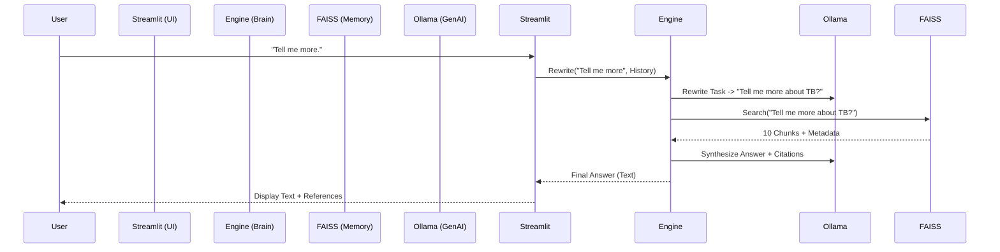

# ScholarBot Architecture & Narrative

This document explains the design philosophy and technical evolution of ScholarBot.

## 1. The Challenge (Clinical Precision vs. User Flexibility)

Building a medical AI requires balancing two opposing needs:
1.  **Rigidity**: It must adhere to strict guidelines (WHO/CDC) to be safe.
2.  **Flexibility**: Users want to upload their own papers ("Chat with PDF") and ask follow-up questions naturally ("What about second-line drugs?").

ScholarBot solves this with a **Tiered, Context-Aware Architecture**.

## 2. Core Components

### A. The "Tiered Search" Engine (`04_engine.py`)
Instead of a single database, we use two:
*   **Main KB (Static)**: Contains immutable "Gold Standard" PDFs (Guidelines).
*   **User KB (Dynamic)**: Contains temporary user uploads.

**Logic Flow**:
1.  **Check Context**: Did the user just upload a file?
    *   **Yes**: Lock search to **User KB Only**. (Prevents Guidelines from overriding the specific paper the user wants to discuss).
    *   **No**: Search **Main KB** first. If confidence < 0.35, fallback to **User KB** (past uploads).

### B. The "Single-Pass" Ingestion Strategy (`00_utils.py`)
**Problem**: Reading extensive PDFs (100+ pages) at query time to find a "Title" or "Bibliography" caused 60-second delays.
**Solution**: We moved this cost to **Ingestion Time**.
*   When a file is added, we scan Page 1 (Title) and the Last 3 Pages (References).
*   This metadata is "stamped" onto every text chunk in the Vector Database (FAISS).
*   **Result**: At query time, citation lookup is **O(1) Instant**.

### C. Conversational Memory (Query Rewriting)
FAISS (Vector Search) is stateless. It doesn't know what you said 10 seconds ago.
*   *User*: "What is Bedaquiline?" -> *Search*: "Bedaquiline" -> *Result*: Good.
*   *User*: "Tell me more." -> *Search*: "Tell me more" -> *Result*: **Garbage** (No semantic meaning).

**Solution**: We implemented a "Pre-Processing" step using the LLM.
1.  Take History + New Question.
2.  LLM Rewrites: "Tell me more" -> "**Tell me more about the mechanism of action of Bedaquiline**".
3.  Search FAISS with the *Rewritten* query.

### D. The Illustrator Agent (`07_illustrator.py`)
Text explanations can be dense. We added a multi-modal agent:
1.  **Analyst**: Llama 3 analyzes the medical answer and writes a *Visual Prompt* (e.g., "A cross-section of a lung alveolus...").
2.  **Artist**: We send this prompt to Pollinations.ai (Stable Diffusion) with strict negative prompting ("No text, no labels") to generate a clean, textbook-style diagram.

## 3. Data Flow

